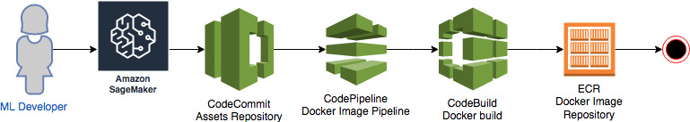
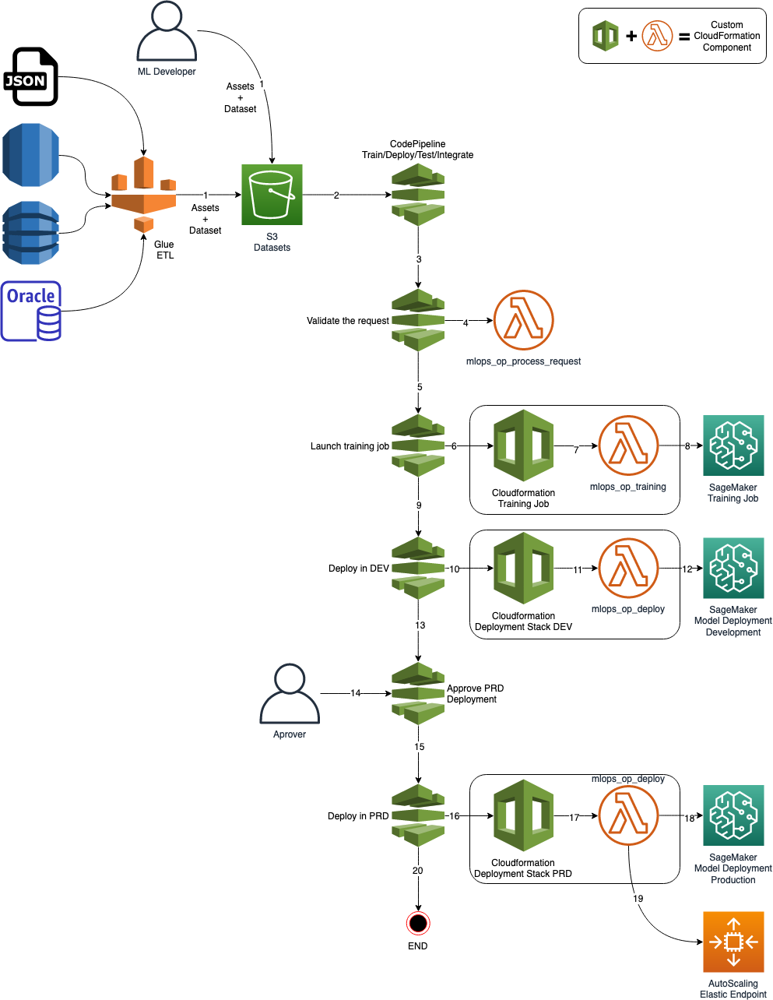
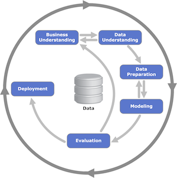
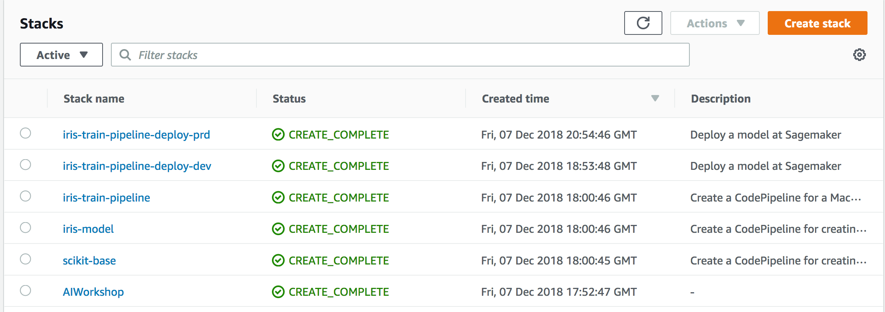

# Amazon Sagemaker Mlops Workshop
-Machine Learning Ops Workshop with SageMaker: lab guides and materials.

## License Summary
This sample code is made available under a modified MIT license. See the LICENSE file.

## Introduction

Data Scientists and ML developers need more than a Jupyter notebook to create a ML model, test it, put into production and integrate it with a portal and/or a basic web/mobile application in a reliable and flexible way.

    

There are two basic questions that you should consider when you start developing a ML model for a real Business Case:

1. How long would it take your organization to deploy a change that involves a single line of code?
2. Can you do this on a repeatable, reliable basis?

So, if you're not happy with the answers, MLOps is a concept that can help you: a) to create or improve the organization culture for CI/CD; b) to create an automated infrastructure that will support your processes.

[Amazon Sagemaker](https://aws.amazon.com/sagemaker/), a service that supports the whole pipeline of a ML Model development, is the heart of this solution. Around it, you can add several different services as the AWS Code* for creating an automated pipeline, building your docker images, train/test/deploy/integrate your models, etc.

Here you can find more information about [DevOps](https://aws.amazon.com/devops/) at AWS ([What is DevOps](https://aws.amazon.com/pt/devops/what-is-devops/)).

## Pre-Requisites

### Services

You should have some basic experience with:
  - Train/test a ML model
  - Python ([scikit-learn](https://scikit-learn.org/stable/#))
  - [Jupyter Notebook](https://jupyter.org/)
  - [AWS CodePipeline](https://aws.amazon.com/codepipeline/)
  - [AWS CodeCommit](https://aws.amazon.com/codecommit/)
  - [AWS CodeBuild](https://aws.amazon.com/codebuild/)
  - [Amazon ECR](https://aws.amazon.com/ecr/)
  - [Amazon SageMaker](https://aws.amazon.com/sagemaker/)
  - [AWS CloudFormation](https://aws.amazon.com/cloudformation/)

Some experience working with the AWS console is helpful as well.

### AWS Account

In order to complete this workshop you'll need an AWS Account with access to the services above. There are resources required by this workshop that are eligible for the AWS free tier if your account is less than 12 months old. See the [AWS Free Tier](https://aws.amazon.com/free/) page for more details.

## Scenario

In this workshop you'll implement and experiment a basic MLOps process, supported by an automated infrastructure for training/testing/deploying/integrating ML Models. It is comprised into four parts:

1. You'll start with a **WarmUp**, for reviewing the basic features of Amazon Sagemaker;
2. Then you will create a **basic Docker Image** for supporting any scikit-learn model;
3. Then you will create a **dispatcher Docker Image** that supports two different algorithms;
4. Finally you will train the models, deploy them into a **DEV** environment, approve and deploy them into a **PRD** environment with **High Availability** and **Elasticity**;

Parts 2, 3 and 4 are supported by automated pipelines that reads the assets produced by the ML devoloper and execute/control the whole process.

### Architecture
For parts 2 and 3 the following architecture will support the process. In part 2 you'll create an Abstract ScikitLearn Docker Image. In part 3 you'll extend that Abscract image and create the final image using two distinct Scikit Learn algorithms.

1. The **ML Developer** creates the assets for Docker Image based on Scikit Learn, using Sagemaker, and pushes all the assets to a Git Repo (CodeCommit);
2. CodePipeline listens the push event of CodeCommit, gets the source code and launches CodeBuild;
3. CodeBuild authenticates into ECR, build the Docker Image and pushes it into the ECR repository
4. Done.

For part 4 you'll make use of the following structure for training the model, testing it, deploying it in two different environments: DEV - QA/Development (simple endpoint) and PRD - Production (HA/Elastic endpoint).

**Altough there is an ETL part in the Architecture, we'll not use Glue or other ETL tool in this workshop. The idea is just to show you how simple it is to integrate this Architecture with your Data Lake and/or Legacy databases using an ETL process**

1. An ETL process or the ML Developer, prepares a new dataset for training the model and copies it into an S3 Bucket;
2. CodePipeline listens to this S3 Bucket, calls a Lambda function for start training a job in Sagemaker;
3. The lambda function send a training job to Sagemaker, enables a rule in CloudWatchEvents that will check each minute, through another Lambda Function, if the training job has finished or failed
4. CodePipeline will awaits for the training approval with success or failure;
5. This lambda will approve or reject this pipeline, based on the Sagemaker results;
6. If rejected the pipeline stops here; If approved it goes to the next stage;
7. CodePipeline calls CloudFormation to deploy a model in a Development/QA environment into Sagemaker;
8. After finishing the deployment in DEV/QA, CodePipeline awaits for a manual approval
9. An approver approves or rejects the deployment. If rejected the pipeline stops here; If approved it goes to the next stage;
10. CodePipeline calls CloudFormation to deploy a model into production. This time, the endpoint will count with an AutoScaling policy for HA and Elasticity.
11. Done.

### Crisp DM

It is important to mention that the process above was based on an Industry process for Data Mining and Machine Learning called [CRISP-DM](https://en.wikipedia.org/wiki/Cross_Industry_Standard_Process_for_Data_Mining).

CRISP-DM stands for “Cross Industry Standard Process – Data Mining” and is an excellent skeleton to build a data science project around.

       

There are 6 phases to CRISP:
   - **Business understanding**: Don’t dive into the data immediately! First take some time to understand: Business objectives, Surrounding context, ML problem category.
   - **Data understanding**: Exploring the data gives us insights about tha paths we should follow.
   - **Data preparation**: Data cleaning, normalization, feature selection, feature engineering, etc.
   - **Modeling**: Select the algorithms, train your model, optimize it as necessary.
   - **Evaluation**: Test your model with different samples, with real data if possible and decide if the model will fit the requirements of your business case.
   - **Deployment**: Deploy into production, integrate it, do A/B tests, integration tests, etc.

Notice the arrows in the diagram though. CRISP frames data science as a cyclical endeavor - more insights leads to better business understanding, which kicks off the process again.

## Instructions

First, you need to execute a CloudFormation script to create all the components required for the exercises.

1. Select the below to launch CloudFormation stack.

Region| Launch
------|-----
US East (N. Virginia) | 

1. Then open the Jupyter Notebook instance in Sagemaker and start doing the exercises:

    1. [Warmup](lab/00_Warmup/01_Basic%20model%20with%20a%20Builtin%20Algorithm.ipynb): This is a basic exercise for exploring the Sagemaker features like: training, deploying and optmizing a model. If you already have experience with Sagemaker, you can skip this exercise.
    2. [Abstract Scikit-learn Image](lab/01_BuildBaseImage/01_Creating%20a%20Scikit-Learn%20Base%20Image.ipynb): Here we'll create an abstract docker image with the codebase for virtually any Scikit-learn algorithm. This is not the final Image. We need to complete this exercise before executing the next one.
    3. [Concrete Scikit-learn models](lab/02_BuildModelImage/01_Creating%20an%20Iris%20Model%20Image.ipynb): In this exercise we'll inherits the Docker image from the previous step and create a concrete Docker image with two different algorithms: Logistic Regression and Random Forest Tree in a dispatcher architecture.
        1. [Test the models locally](lab/02_BuildModelImage/02_Testing%20our%20local%20model%20server.ipynb): This is part of the exercise #3. You can use this jupyter to test your local WebService, to simulate how Sagemaker will call it when you ask it to create an Endpoint or launch a Batch job for you.
    4. [Train your models](lab/02_BuildModelImage/03_Training%20our%20custom%20model.ipynb): In this exercise you'll use the training pipeline. You'll see how to train or retrain a particular model by just copying a zip file with the required assets to a given S3 bucket.
        1. [Check Training progress and test](lab/02_BuildModelImage/04_Check%20Progress%20and%20Test%20the%20endpoint.ipynb): Here you can monitor the training process, approve the production deployment and test your endpoints.
    5. [Stress Test](lab/03_TestingHacking/01_Stress%20Test.ipynb): Here you can execute stress tests to see how well your model is performing.

----
# Cleaning

In order to delete all the assets, created by this workshop, delete the following cloudformation stacks.

Just follow the reverse order
1. AIWorkshop
2. scikit-base
3. iris-model
4. iris-train-pipeline
5. iris-train-pipeline-deploy-dev
6. iris-train-pipeline-deploy-prd

Also, delete the S3 bucket created by the first Cloudformation: **mlops-\<region>-\<accountid>**

----

## License Summary
This sample code is made available under a modified MIT license. See the LICENSE file.

Thank you!
